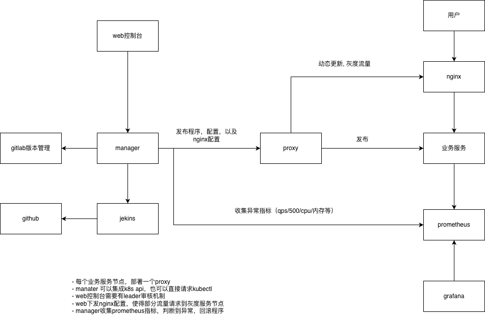

# qnHackathon

智能发布控制台 - Go语言实现

## 项目结构

```
.
├── cmd/
│   └── manager/           # 主程序入口
├── internal/
│   ├── handler/           # HTTP处理器
│   ├── service/           # 业务逻辑层
│   └── model/             # 数据模型
├── web/
│   └── templates/         # HTML模板
├── pkg/
│   └── api/               # API定义
└── go.mod
```

## 功能模块

### 1. 项目管理
- 项目创建、编辑、删除
- 项目列表查询
- 支持多种构建工具和部署类型

### 2. 发布管理
- 创建发布任务
- 支持多种发布策略（蓝绿部署、金丝雀发布、滚动更新）
- 发布状态监控
- 一键回滚功能

### 3. 监控面板
- 实时性能指标展示
- 请求速率监控
- 错误率统计
- 延迟监控（P50/P95/P99）

### 4. 配置管理
- 多环境配置管理
- 配置增删改查

## 技术栈

- **语言**: Go 1.21
- **Web框架**: Gin
- **前端**: HTML + 原生JavaScript
- **架构**: 分层架构（Handler -> Service -> Model）

## 快速开始

### 安装依赖

```bash
go mod download
```

### 运行服务

```bash
go run cmd/manager/main.go -f internal/config/manager.json
```

服务将在 http://localhost:8080 启动

### API端点

- `GET /api/v1/projects` - 获取项目列表
- `POST /api/v1/projects` - 创建项目
- `PUT /api/v1/projects/:id` - 更新项目
- `DELETE /api/v1/projects/:id` - 删除项目
- `GET /api/v1/releases` - 获取发布列表
- `POST /api/v1/releases` - 创建发布
- `GET /api/v1/releases/:id` - 获取发布详情
- `POST /api/v1/releases/:id/rollback` - 回滚发布
- `POST /api/v1/releases/:id/approve` - 审批发布
- `POST /api/v1/releases/:id/deploy` - 部署发布
- `GET /api/v1/monitoring/realtime` - 获取实时监控数据

#### Bin管理API

- `GET /api/v1/keepalive?node_id=<id>` - 查询节点状态
- `POST /api/v1/keepalive` - 注册节点
  - 请求体: `{"node_id": "string", "cpu_arch": "string", "os_release": "string", "node_name": "string", "bin_proxy_version": "string"}`
- `GET /api/v1/bins/:bin_name` - 获取二进制文件信息
- `POST /api/v1/bins/:bin_name` - 更新节点的二进制文件版本
  - 请求体: `{"node_id": "string", "sha256sum": "string"}`
- `POST /api/v1/bins/:bin_name/progress` - 记录二进制文件更新进度
  - 请求体: `{"nodeName": "string", "targetHash": "string", "status": "string", "processingTime": int}`
- `GET /api/v1/download/:bin_file_name` - 下载二进制文件
- `GET /health` - 健康检查

### Web页面

- `/` - 首页
- `/projects` - 项目管理
- `/releases` - 发布管理
- `/monitoring` - 监控面板
- `/config` - 配置管理

## 架构说明

按照系统架构文档实现了以下层次：

1. **API Gateway层**: 使用Gin框架实现统一的HTTP入口
2. **业务服务层**: 包含项目管理、发布编排、监控服务
3. **数据模型层**: 定义核心数据结构
4. **Web展示层**: HTML模板实现控制台页面



## 开发计划

- [ ] 数据持久化（MySQL/PostgreSQL）
- [ ] 认证授权（JWT）
- [ ] WebSocket实时推送
- [ ] 审批流服务
- [ ] 通知服务集成
- [ ] 完善单元测试

# jenkins地址
http://101.133.131.188:38010

# gitlab地址
http://101.133.131.188:30811
