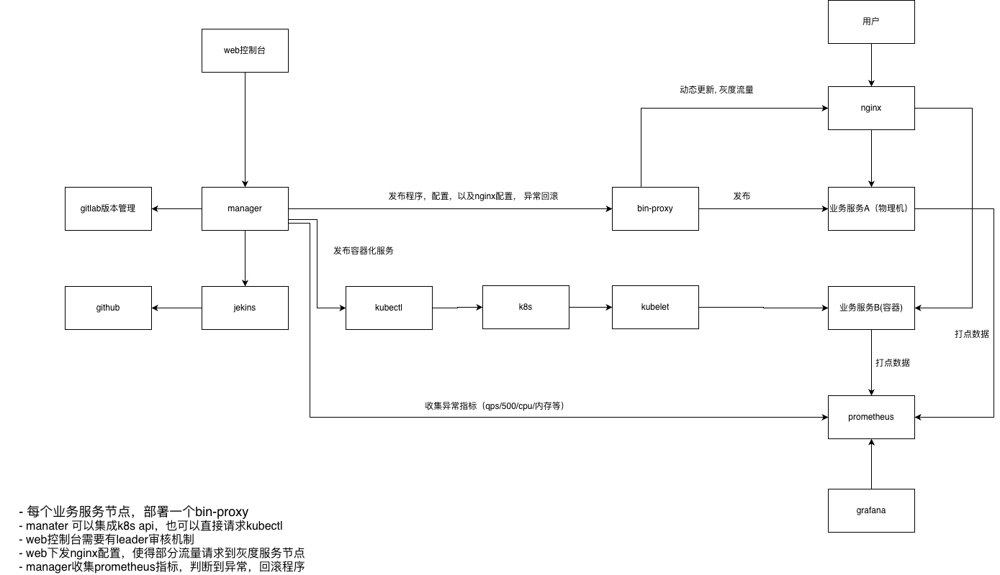

# qnHackathon

智能发布控制台 - 基于 Go + MongoDB 的自动化发布管理系统

## 项目简介

本项目是一个智能化的软件发布控制台，支持项目管理、多种发布策略、实时监控和灰度发布等功能。系统通过 Manager 服务提供发布编排能力，配合 Runner-Proxy 和 Bin-Proxy 实现自动化的二进制文件和容器化应用的升级部署。

## 项目结构

```bash
.
├── cmd/
│   └── manager/              # Manager 主程序入口
├── internal/
│   ├── handler/              # HTTP 请求处理器
│   │   ├── project.go        # 项目管理
│   │   ├── release.go        # 发布管理
│   │   ├── gray_release.go   # 灰度发布管理
│   │   ├── config.go         # 配置管理
│   │   ├── monitoring.go     # 监控数据
│   │   ├── bin.go            # 二进制文件管理
│   │   └── web.go            # Web 页面路由
│   ├── service/              # 业务逻辑层
│   │   ├── manager.go        # Manager 服务
│   │   ├── project.go        # 项目服务
│   │   ├── release.go        # 发布服务
│   │   ├── gray_release.go   # 灰度发布服务
│   │   ├── bin.go            # Bin 服务
│   │   ├── github.go         # GitHub 集成
│   │   ├── gitlab.go         # GitLab 集成
│   │   └── jekins.go         # Jenkins 集成
│   ├── model/                # 数据模型定义
│   ├── db/                   # 数据库操作（MongoDB）
│   └── config/               # 配置文件
│       ├── config.go
│       └── manager.json      # Manager 配置文件
├── web/
│   └── templates/            # HTML 模板文件
│       ├── index.html        # 首页
│       ├── projects.html     # 项目管理页面
│       ├── releases.html     # 发布管理页面
│       ├── monitoring.html   # 监控面板
│       └── config.html       # 配置管理页面
├── runner-proxy/             # Runner-Proxy 部署脚本
│   ├── deploy/               # Ansible 部署 Playbooks
│   │   ├── 01_pre_download.yaml
│   │   ├── 02_deploy.yaml
│   │   ├── 03_post_check.yaml
│   │   └── 04_rollback.yaml
│   └── k8s-hosts             # Kubernetes 集群节点配置
├── scripts/                  # Bin-Proxy 相关脚本
│   ├── bin-proxy.sh          # Bin-Proxy Shell 脚本
│   ├── binproxy.py           # Bin-Proxy Python 版本
│   ├── bin-inspector.sh      # 二进制巡检脚本
│   └── bin-manifests.json    # 二进制文件清单
├── doc/                      # 文档和架构图
├── Dockerfile.binproxy       # Bin-Proxy Docker 镜像
├── Makefile                  # 构建脚本
└── go.mod
```

## 功能模块

### 1. 项目管理

- 项目创建、编辑、删除
- 项目列表查询
- 支持多种构建工具和部署类型

### 2. 发布管理

- 创建发布任务
- 支持多种发布策略（蓝绿部署、金丝雀发布、滚动更新）
- 发布状态监控
- 一键回滚功能

### 3. 灰度发布管理

- 创建和管理灰度发布配置
- 支持多种灰度规则（设备 ID、版本号、平台、自定义属性）
- 设备灰度状态追踪和统计
- 灰度规则校验和匹配
- 支持从灰度到全量发布的切换
- 实时查看灰度设备数据和状态

### 4. 监控面板

- 实时性能指标展示
- 请求速率监控
- 错误率统计
- 延迟监控（P50/P95/P99）

### 5. 配置管理

- 多环境配置管理
- 配置增删改查
- 配置历史版本管理
- 配置版本对比
- 与 GitLab 集成的配置同步

### 6. Bin-Proxy（二进制代理）

- 基于 crontab 的自动化二进制文件升级
- SHA-256 哈希校验确保文件完整性
- 与 Manager API 交互获取最新版本
- 支持自动回滚和健康检查
- 文件锁机制防止并发冲突
- 进度追踪和状态上报
- Keepalive 机制维持节点状态

### 7. Runner-Proxy（运行器代理）

- 负责 bin-proxy 和其他类型的应用部署任务
- 基于 Ansible 的部署编排
- 支持四阶段部署流程（预下载、部署、检查、回滚）
- 与 Semaphore UI 集成执行复杂任务
- 支持二进制和容器化应用部署
- 从 Manager 领取和执行发布任务

## 技术栈

- **语言**: Go 1.24.0
- **Web 框架**: Gin
- **数据库**: MongoDB
- **前端**: HTML + 原生 JavaScript + CSS
- **CI/CD 集成**: Jenkins、GitHub、GitLab
- **自动化运维**: Ansible、Semaphore UI
- **架构模式**: 分层架构（Handler -> Service -> Model）
- **主要依赖**:
  - `github.com/gin-gonic/gin` - Web 框架
  - `go.mongodb.org/mongo-driver` - MongoDB 驱动
  - `github.com/bndr/gojenkins` - Jenkins API 客户端
  - `gitlab.com/gitlab-org/api/client-go` - GitLab API 客户端
  - `github.com/google/go-github` - GitHub API 客户端
  - `github.com/rs/zerolog` - 日志库

## 快速开始

### 安装依赖

```bash
go mod download
```

### 运行服务

```bash
go run cmd/manager/main.go -f internal/config/manager.json
```

服务将在 <http://localhost:38012> 启动

### API 端点

#### 项目管理 API

- `GET /api/v1/projects` - 获取项目列表
- `POST /api/v1/projects` - 创建项目
- `PUT /api/v1/projects/:id` - 更新项目
- `DELETE /api/v1/projects/:id` - 删除项目

#### 发布管理 API

- `GET /api/v1/releases` - 获取发布列表
- `POST /api/v1/releases` - 创建发布
- `POST /api/v1/releases/batch-delete` - 批量删除发布
- `GET /api/v1/releases/:id` - 获取发布详情
- `POST /api/v1/releases/:id/rollback` - 回滚发布
- `POST /api/v1/releases/:id/approve` - 审批发布
- `POST /api/v1/releases/:id/deploy` - 部署发布

#### 灰度发布 API

- `GET /api/v1/gray-releases` - 获取灰度发布列表
- `POST /api/v1/gray-releases` - 创建灰度发布配置
- `GET /api/v1/gray-releases/:id` - 获取灰度发布详情
- `PUT /api/v1/gray-releases/:id` - 更新灰度发布配置
- `DELETE /api/v1/gray-releases/:id` - 删除灰度发布配置
- `GET /api/v1/gray-releases/device-stats` - 获取灰度设备统计
- `POST /api/v1/gray-releases/full-release` - 执行全量发布
- `POST /api/v1/gray-releases/device-status` - 更新设备状态
- `POST /api/v1/gray-releases/check-rule` - 校验设备灰度规则

#### 配置管理 API

- `GET /api/v1/configs` - 获取配置列表
- `POST /api/v1/configs` - 创建配置
- `GET /api/v1/configs/:id` - 获取配置详情
- `PUT /api/v1/configs/:id` - 更新配置
- `DELETE /api/v1/configs/:id` - 删除配置
- `GET /api/v1/configs/:id/history` - 获取配置历史
- `GET /api/v1/configs/history` - 按项目获取配置历史
- `GET /api/v1/configs/compare` - 对比配置版本
- `GET /api/v1/configs/versions` - 获取配置版本列表

#### 监控 API

- `GET /api/v1/monitoring/realtime` - 获取实时监控数据
- `GET /api/v1/monitoring/timeseries` - 获取时序监控数据

#### Bin-Proxy 管理 API

- `GET /api/v1/keepalive` - 查询节点状态
- `POST /api/v1/keepalive` - 注册/更新节点
  - 请求体: `{"node_id": "string", "cpu_arch": "string", "os_release": "string", "node_name": "string", "bin_proxy_version": "string"}`
- `GET /api/v1/bins/:bin_name` - 获取二进制文件最新版本信息
- `POST /api/v1/bins/:bin_name` - 更新节点的二进制文件版本
  - 请求体: `{"node_id": "string", "sha256sum": "string"}`
- `POST /api/v1/bins/:bin_name/progress` - 上报二进制文件更新进度
  - 请求体: `{"nodeName": "string", "targetHash": "string", "status": "string", "processingTime": int}`
- `GET /api/v1/download/:bin_file_name` - 下载二进制文件

#### 系统 API

- `GET /health` - 健康检查

### Web页面

- `/` - 首页
- `/projects` - 项目管理
- `/releases` - 发布管理
- `/monitoring` - 监控面板
- `/config` - 配置管理

## 构建和部署

### 使用 Makefile 构建

项目提供了 Makefile 简化构建流程：

```bash
# 查看所有可用命令
make help

# 构建 Manager Docker 镜像
make build-manager

# 构建 Bin-Proxy Docker 镜像
make build-proxy

# 构建 Supervisor Docker 镜像（用于测试）
make build-supervisor

# 构建所有镜像
make build-all

# 运行 Manager 容器
make run-manager

# 运行 Bin-Proxy 容器
make run-proxy

# 清理 Docker 镜像
make clean
```

### 配置文件

Manager 服务需要配置文件 `internal/config/manager.json`：

```json
{
  "jenkinsConf": {
    "apitoken": "your-jenkins-api-token",
    "username": "admin",
    "url": "http://your-jenkins-host:8080",
    "projectID": "your-project"
  },
  "gitlabConf": {
    "url": "http://your-gitlab-host",
    "privateToken": "your-gitlab-token",
    "projectID": "group/project"
  },
  "mongoConf": {
    "url": "mongodb://your-mongo-host:27017",
    "database": "qnHackathon"
  }
}
```

### Bin-Proxy 部署

详细的 Bin-Proxy 部署和使用说明，请参考 [scripts/README.md](scripts/README.md)。

### Runner-Proxy 部署

Runner-Proxy 的部署流程和 Ansible Playbook 说明，请参考 [runner-proxy/deploy/README.md](runner-proxy/deploy/README.md)。

## 系统架构

系统采用分层架构设计，主要包含以下组件：

### 1. Manager 服务（管理控制台）

- **API Gateway 层**: 基于 Gin 框架提供统一的 HTTP 接口
- **业务服务层**: 包含项目管理、发布编排、监控、配置管理和灰度发布服务
- **数据模型层**: 定义核心数据结构
- **数据持久层**: MongoDB 数据库存储
- **Web 展示层**: HTML 模板实现控制台页面

### 2. Runner-Proxy（运行器代理）

- 部署在各个集群中，负责执行具体的部署任务
- 从 Manager 领取发布任务
- 基于 Ansible Playbook 执行四阶段部署（预下载、部署、检查、回滚）
- 与 Semaphore UI 集成，支持复杂的自动化运维任务
- 支持二进制和容器化应用的部署

### 3. Bin-Proxy（二进制代理）

- 部署在各个节点上，负责二进制文件的自动化升级
- 基于 crontab 定时检查版本更新（每分钟执行一次）
- 通过 SHA-256 哈希值校验文件完整性
- 支持自动下载、替换、重启服务
- 提供健康检查和自动回滚能力
- 实时上报节点状态和处理进度

### 4. 外部集成

- **Jenkins**: 触发构建和获取构建产物
- **GitLab**: 代码仓库管理和 CI/CD 集成
- **GitHub**: 代码仓库管理
- **Semaphore UI**: 任务编排和执行引擎
- **MongoDB**: 数据持久化存储



## 开发计划

### 已完成

- [x] 数据持久化（MongoDB）
- [x] 前端 Web 页面
- [x] Jenkins、GitHub、GitLab 联动
- [x] Bin-Proxy 开发（Shell 和 Python 版本）
- [x] Runner-Proxy 基于 Ansible 的部署流程
- [x] 灰度发布管理功能
- [x] 配置管理和版本对比
- [x] 批量操作（批量删除发布）

### 进行中

- [ ] 下发 Nginx 配置，导入灰度流量
- [ ] 获取 Prometheus 异常指标，自动回滚
- [ ] Manager 集成 kubectl 功能，支持镜像发布

### 计划中

- [ ] 智能发布决策（AI 辅助）
- [ ] 认证授权（JWT）
- [ ] 审批流服务
- [ ] 通知服务集成（钉钉、企业微信、邮件）
- [ ] 完善单元测试
- [ ] 性能优化和监控增强

## jenkins 地址

- <http://101.133.131.188:38010>
- 用户名:admin
- 密码：e99c6614893247c2aa2b7b1b3f964517

## gitlab 地址

- <http://101.133.131.188:30811>
- 用户名: root
- 密码: ofB4koHkZe6J5uqmrkBcH5tm/fpCPEcR1ol6YdQAUd0=

## semaphore 地址

semaphore 提供版本的具体的执行功能

- 每个版本的部署都对应一个 semaphore 任务（资源对象）
- 任务（以及任务的依赖）可以通过接口创建，触发，查询状态，查询结果: bin-proxy(runner-proxy) 从 manager 获取版本任务，将任务同步为 semaphore 的任务，并执行。manager 也能直接扩展操作 semaphore 的任务。
- 任务的依赖从 github 拉取：比如任务的执行列表，元数据，脚本等

环境：

- <http://101.133.131.188:38020>
- 用户名: admin
- 密码: qiniu1024

```bash

docker run -p 38020:3000 --name semaphore \
 -e SEMAPHORE_DB_DIALECT=bolt \
 -e SEMAPHORE_ADMIN=admin \ # 用户
 -e SEMAPHORE_ADMIN_PASSWORD=qiniu1024 \ # 密码
 -e SEMAPHORE_ADMIN_NAME=Admin \
 -e SEMAPHORE_ADMIN_EMAIL=admin@localhost \
 -d semaphoreui/semaphore:latest

```

## 演示环境

### 项目演示地址

- Manager 控制台: <http://101.133.131.188:38012/>

### 相关服务地址

演示环境中集成了以下服务，便于测试完整的 CI/CD 流程：

- **Jenkins**: <http://101.133.131.188:38010>
  - 用户名: admin
  - 密码: e99c6614893247c2aa2b7b1b3f964517

- **GitLab**: <http://101.133.131.188:30811>
  - 用户名: root
  - 密码: ofB4koHkZe6J5uqmrkBcH5tm/fpCPEcR1ol6YdQAUd0=

- **Semaphore UI**: <http://101.133.131.188:38020>
  - 用户名: admin
  - 密码: qiniu1024
  - 说明: Semaphore 提供版本的具体执行功能，每个版本的部署对应一个 Semaphore 任务

### 模拟业务服务

- 代码仓库: <https://gitee.com/swayinwind/streamd.git>
- 说明: 服务启动后会启动一个 Web 服务，在 Web 页面上展示服务的版本号，用于验证发布效果

## 核心特性

### 1. 多策略发布

- 支持蓝绿部署、金丝雀发布、滚动更新等多种发布策略
- 灵活的灰度规则配置（设备 ID、版本、平台等）
- 一键全量发布和回滚

### 2. 自动化运维

- Bin-Proxy 实现二进制文件的自动化升级
- Runner-Proxy 基于 Ansible 实现标准化部署流程
- 与 Semaphore UI 集成执行复杂运维任务

### 3. CI/CD 集成

- 支持 Jenkins、GitLab、GitHub 多种 CI/CD 工具
- 自动触发构建和部署
- 配置文件版本管理和同步

### 4. 实时监控

- 性能指标实时展示
- 请求速率、错误率、延迟等关键指标监控
- 支持 P50/P95/P99 延迟统计

### 5. 安全可靠

- SHA-256 文件完整性校验
- 自动健康检查和回滚
- 文件锁机制防止并发冲突
- MongoDB 数据持久化

## 贡献指南

欢迎提交 Issue 和 Pull Request！

## 许可证

MIT License
